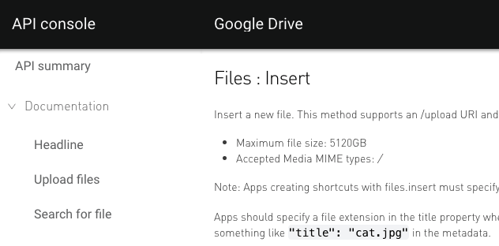
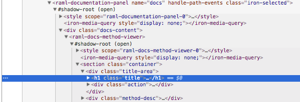

# Styling the API Console

Theming is based on [CSS variables] and CSS mixins. Basic concepts of using the variables and mixins are described in [Polymer 1.0 styling] documentation.

Note that the CSS mixins are not standardized and therefore require additional libraries to support it. Polymer has it's own implementation of CSS mixins.

## Basics

Basic theme is defined in [api-console-styles.html](../api-console-styles.html) file. Inside you'll find a lot of CSS variables and mixins definitions.

Each of this definition is used to style one of the elements that has been used to build the API console. Most of the elements (at least elements that contain an UI) has their own accepts some set of variables / mixins that will be applied to element's internal content.

For example `--raml-path-selector-background-color` variable will be accepted by the `raml-path-selector` element (main navigation element) and applied to the element's background color.

This way theming is possible for encapsulated web components. Also, most of the variables has element's name prefix for better understanding where given variable / mixin will be applied.

To start creating your own theme you should be familiar with [ARC elements catalog](https://elements.advancedrestclient.com/). It contains all web components used to build the API console. Here you will find documentation and styling guide for all components.

So, let's assume you'd like to change a style for the title of the HTTP method in the documentation:

The fastest way to style it is to recognize the custom element that contains this title. Use Chrome DevTools inspector (or any other) to inspect this title element.

As you can see, this title is hosted by the `<raml-docs-method-viewer>` element that can be find in the catalog at https://elements.advancedrestclient.com/elements/raml-docs-method-viewer. From the documentation we can see that there are few methods to style this element:
- `--raml-docs-h1` mixin
- `--raml-docs-method-viewer-title-method-font-weight` variable
- `--arc-font-headline` mixin

Setting any of above properties in your own style definition will alter this element's styles.

## Sizing the embeddable element

The `api-console` must either be explicitly sized, or contained by the explicitly
sized parent. Parent container also has to be positioned relatively
(`position: relative` CSS property). "Explicitly sized", means it either has
an explicit CSS height property set via a class or inline style, or else is
sized by other layout means (e.g. the flex layout or absolute positioning).

[CSS variables]: https://developer.mozilla.org/en-US/docs/Web/CSS/Using_CSS_variables
[Polymer 1.0 styling]: https://www.polymer-project.org/1.0/docs/devguide/styling
